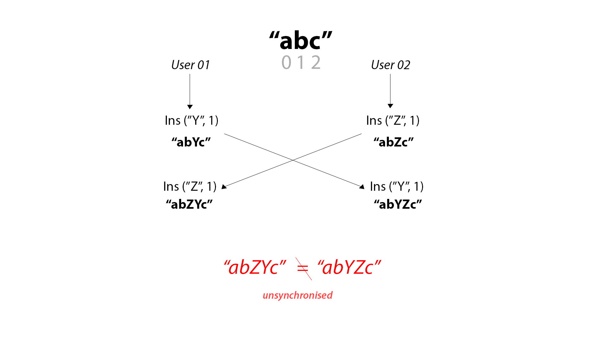

# Wordsmiths
Wordsmiths is an open-source repository built for one purpose; understanding and applying operational transformation using Python and Flask.

All information presented is from the personal understanding and supporting documents.
Feel free to make a pull request if there is anything I've misinterpreted.


## Install
```
pip install wordsmiths
```


**[View the project](https://www.wordsmiths.io)** - currently under work

-----

## Contents
1. [Introduction](#introduction)
2. [Usage](#usage)
3. [Operations](#operations)
4. [Transformations](#transformations)
5. [Compression Algorithms](#compression_algorithms)
6. [Transformation Functions](#transformation_functions)
8. [Sockets](#sockets)

-----

## Introduction
> Wordsmiths is an open-source repository built for one purpose; understanding and applying operational transformation using Python and Flask.

Operational Transformation (OT) is a system of algorithms designed to resolve conflicts between users in a real-time collaborative editing environment. The ultimate intention of Operational Transformation is to maintain and synchronise a consistent state between any number of users in a shared document in high latency environments.

The goal of this document is to extensively document the system and implement it.


-----

## Usage
#### See transform.py comments for more example usage.

```python
# standard import 
from wordsmiths import OT_Char, OT_String

# instantiate to variable
OT = OT_String()

# call transform method
OT.transform(op1, op2) 
```

-----

## Operations
OT is a concatenation of two key processes; Operations and Transformations. Operations refer to an action which is performed on a document by a user. These actions can be a variety of different elements depending on the capabilities of the document editor, yet the fundamental operations of basic text documents are inserting and deleting characters at a specific index of the document with respect to the position of the cursor. An example of a set of operations can be observed in Figure 1.

*Figure 1. A set of simple operations relevant to a text editor*


| Operation                 | Desired effect           |
| -------------             |:-------------:|
| Insert(char, index)       | Inserts specific character at relative index. |
| Delete(char, index)       | Deletes specific character at relative index. |
| Retain(n)                 |  Advances the cursor “n” number of times.     |


The initial problem which OT was developed to solve are the conflicts which occur as a result of multiple users concurrently executing operations on a document. If multiple users attempt to execute an operation at a specific index of a document, there will be inconsistencies when their operations are sent to the other user - leaving the document in an unsynchronised state. This problem is illustrated in Figure 2, where two users attempt to execute an insert operation on a document.

*Figure 2. The concurrent operations problem*


In this scenario, the users start with an initial string “abc”, User-01 intends to insert the character “Y” at the index “1” and User-02 intends to insert the character “Z” at the index “1”. Both of the users execute the operation locally, resulting in the strings “abYc” and “abZc” respectively. After local execution, they both send their operations to each other and execute it straight away - subsequently resulting in two different strings “abZYc” and “abYZc”. This problem illustrates how naively sending operations between clients will result in inconsistent states between users, thus, preventing the ability to collaboratively edit on a document. The solution to this problem is to first transform both operations together when it is sent to the other user so that we can achieve the intentions of both users.

In this specific python implementation, operations are stored as dictionaries in a list, eg;

```python
op1 = [{'retain': 1}, {'insert', 'a'}]
```

-----

## Transformations
The transform is the core element of Operational Transformation, it does the heavy lifting for the system. Transforms essentially define the rules for converging multiple operations together.

Google defines this transformation process with the mathematical identity;


This essentially states that when the transform is given two operations, a and b respectively, it will derive two new operations known as a’ and b’. Effectively, these two derivatives can then be applied to both users to achieve a synchronised, equal state. This mathematical identity is illustrated in a state diagram in Figure 3, showing how the derivatives from transform can be used to achieve the same state.

-- > to be continued 

----- 

## Compression Algorithms
#### Warning! Compression is only applicable to string-wise transformation functions. This will not work if you are using character-wise transformation algorithms.

As opposed to storing *every* single operation (eg, typing a character) received by *every* user in *every* document - we can save valuable storage by compressing operations together before sending them for processing. This assumes an OT model which makes clients wait for server acknowledgement before sending more operations. During this state of waiting for acknowledgement, the client compresses the character-wise operations into strings where applicable. This is cost-efficient as the only thing the server has to do for each user is receive, apply, potentially transform and send operations and the client does the supposed "lifting" when it performs compression (which in itself is a relatively cheap operation).

-----
## Transformation Functions
See transform.py for code-commented transformation functions.

-----
## Sockets 
Sockets is the desirable web protocol for an OT system, since there is an almost constant communication between a client and server, using long-polling ajax requests becomes cumbersome and inefficient extremely quick. Sockets eliminates the need for continous requests, and just opens the connection between the server and client - also enabling an example where multiple clients are connected to one document. 

In the example of this implementation, Flask-SocketIO(link) is used to satisfy socket requirements on the python server-side and the SocketIO javascript implementation is used to connect to the client over ws://. 


## Further Reading
